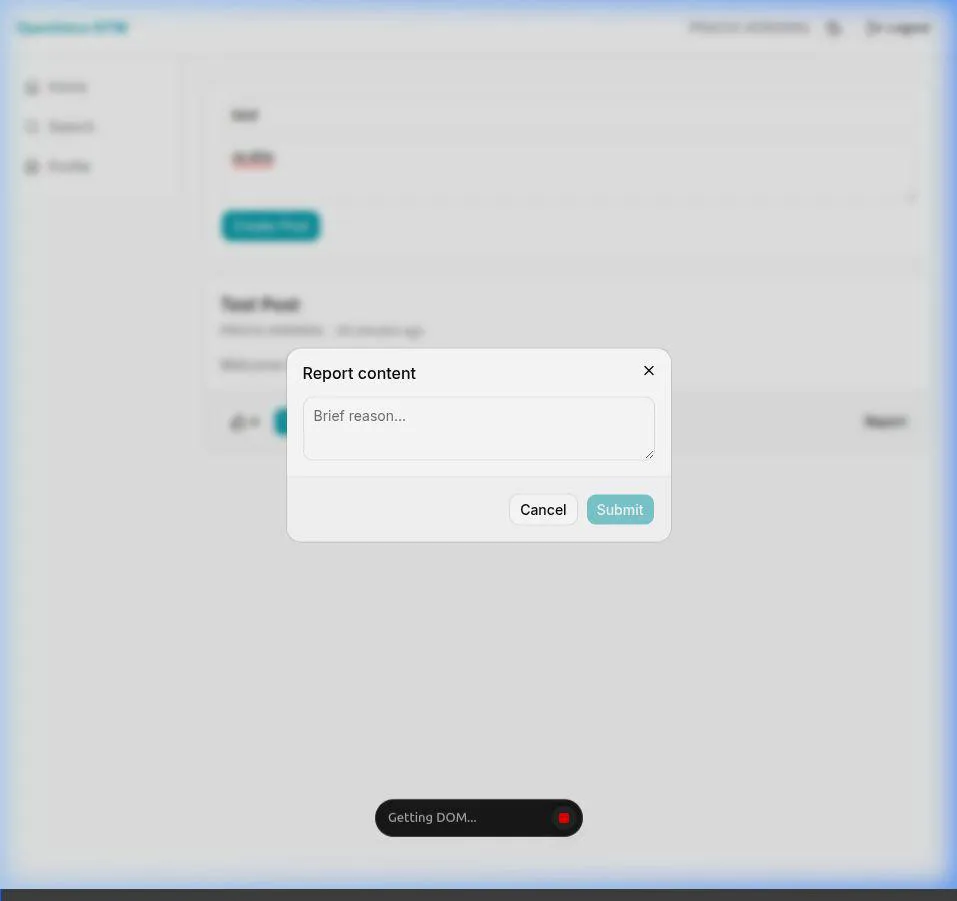

# OpenVoice IIITM Demonstration

I have run the application and used a browser subagent to perform a full walkthrough of the core features you requested. 

Here is the recorded demonstration of the platform in action. The agent logs in via the Mock Login button (which bypasses Google OAuth using `@iiitm.ac.in` mock credentials), navigates the feed, creates a new post, reacts to posts (like/dislike), submits a report, and utilizes the search functionality.

## Verified Features:
1. **Authentication:** Successfully logged in using the Mock College ID (`img_2023041@iiitm.ac.in`).
2. **Posting:** Navigated to the main feed and successfully created a post.
3. **Reactions:** Used the Like and Dislike actions on posts.
4. **Reporting:** Interacted with the Report modal to file moderation reports.
5. **Search:** Verified the search input functionality directly from the sidebar. 
6. **Feed Access:** Scrolled through the global feed displaying all users' posts.

All these operations have properly executed and are functioning as expected within the local development environment!
